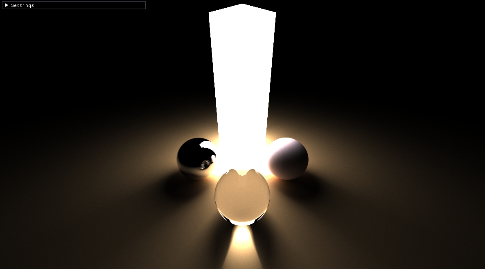
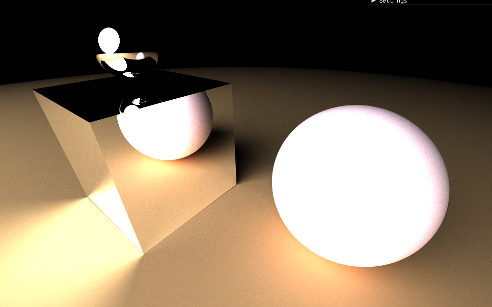

# Path Tracer

<p align="middle">
  
   
  
</p>

## Compilation

To compile, you need GLFW and CMake installed on your system.
<br>
If above requirements are fulfilled, just run the following.
```
git clone --recursive https://github.com/RaphaelAsla/PathTracer.git
mkdir build && cd build
CXX=clang++ cmake -DCMAKE_BUILD_TYPE=Release ..
make
./raytracer
```
## This project is under development
### What's Next
- Implement textures
- Integrate BVH (Bounding Volume Hierarchy)
- Implement BRDF lighting
- Anything else that catches my fancy
